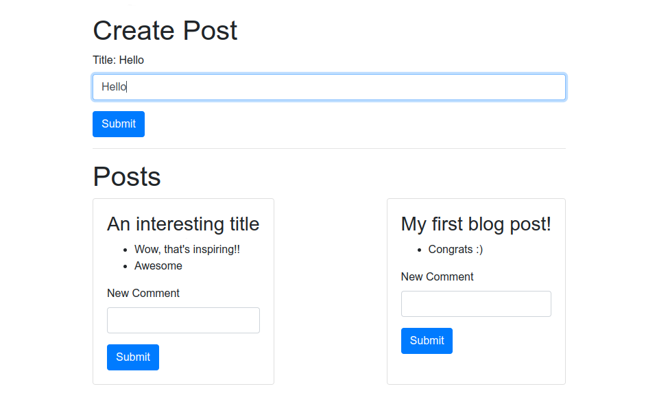

# Vue.js micro blog

This **micro blog** is a **student project** I built in **Ludovic Laloux's class** during my Continuing Education course at **Toulouse Institute of Technology**.

Working on this project, I learned to use **Vue.js 3** along with **Bootstrap**. I also built a basic server using **Node.js**.

## Technologies used

- Vue.js 3
- Bootstrap
- Node.js: Express, Cors, randomBytes

## Skills gained

- Create a **single page application** using **Vue.js** and **Vite**
- Use **axios** to make **HTTP requests**
- Handle **user inputs** with the **v-model** directive
- Respond to and handle user events with **event handlers**
- Use **computed properties** to iterate through arrays and objects
- Use **props and events** to pass data to components
- Use **lifecycle hooks** to run code at specific stages
- **Apply Bootstrap classes** to quickly style components

## Functionalities

- Display the post's title as it's being typed
- Hot reload for blog posts
- Hot reload for comments on posts

## Credit

- [Course Source Code](https://github.com/ludolaloux13/vuejs-n7)
